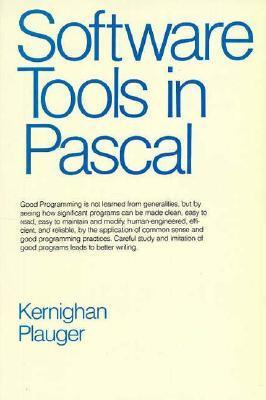

= Software Tools in Go

This repository is `Go` adaptation of code for the book
https://www.goodreads.com/en/book/show/515602[Software Tools in Pascal].

== Chapters
Each chapter has its own readme.

* link:ch1/CH1.adoc[]
* link:ch2/CH2.adoc[]
* link:ch3/CH3.adoc[]
* link:ch4/CH4.adoc[]
* link:ch5/CH5.adoc[]
* link:ch6/CH6.adoc[]

== Good to Know

Good to know that
> Pascal, like many languages, does not guarantee any particular order for evaluation of logical expressions (or any other expressions, for that matter), nor does
it guarantee that evaluation of a logical expression will terminate as soon as the
truth value is known

That affected code as any other Pascal restrucitons (like funciton "returns").

== Contributing

Improvements are welcome! Feel free to create issues or pull requests.
Feel free to refactor the code to make it more idiomatic for `Go`.
